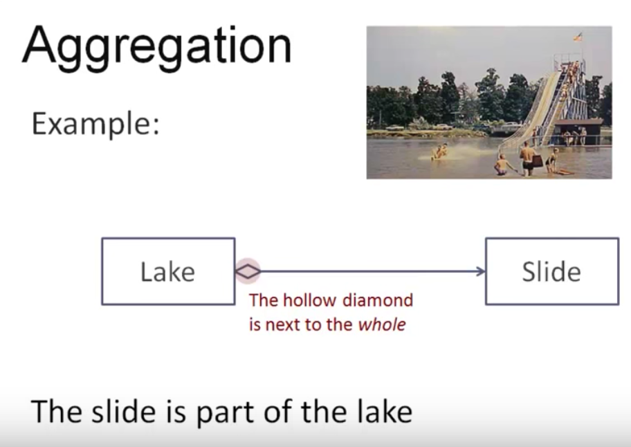
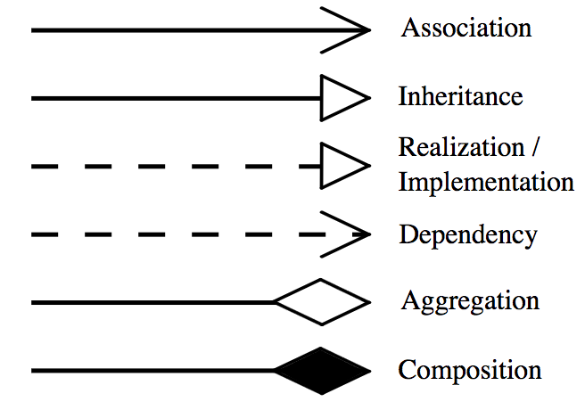

# UML Class Diagram
## Class fields and methods

## Relationship Among Classes:
## Dependency

## Association

## Aggregation
* Weak Has-A or Whole-Part Relationship
* Represented by a hollow diamond next to the class that is whole.
* This is called *weak* since the part instances can exist independently of the whole / container instances.
* For instance, Aggregation can occur when a class is a collection or container of other classes, but the contained classes do not have a strong lifecycle dependency on the container. The contents of the container are not automatically destroyed when the container is.
In the example below, the SimpleMessage objects are created independently and added to the collection in MultiMessage.
* Example: Library has Students and books. Here the student can exist without library, the relation between student and library is aggregation.
* Example: Lake has a slide, but the slide can exist independently out of the lake.

  
 

## Composition

## Inheritance / Generalization
* This relationship is between classes themselves -- not between instances.

### Relation Notation

### Example

## References:
* https://www.youtube.com/watch?v=5Q0ZM6ODBHw
* https://www.youtube.com/watch?v=3cmzqZzwNDM
* https://www.youtube.com/watch?v=BhEoV57nj0Q